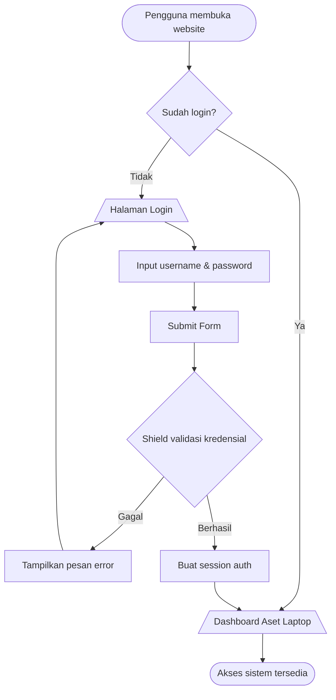
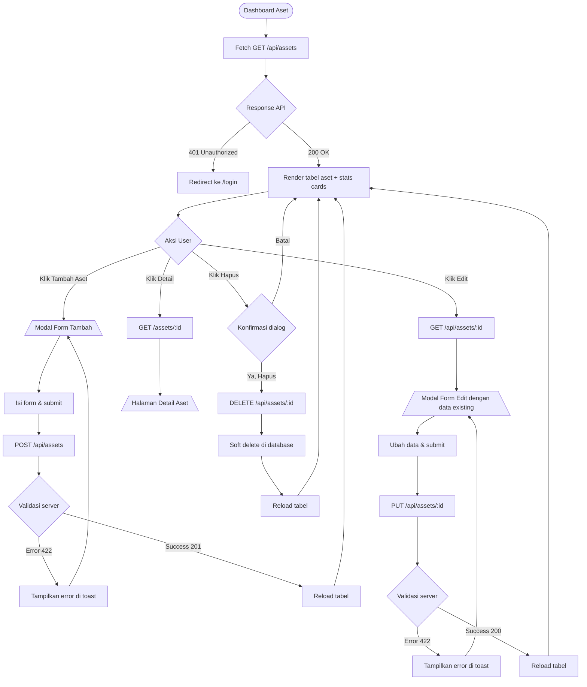
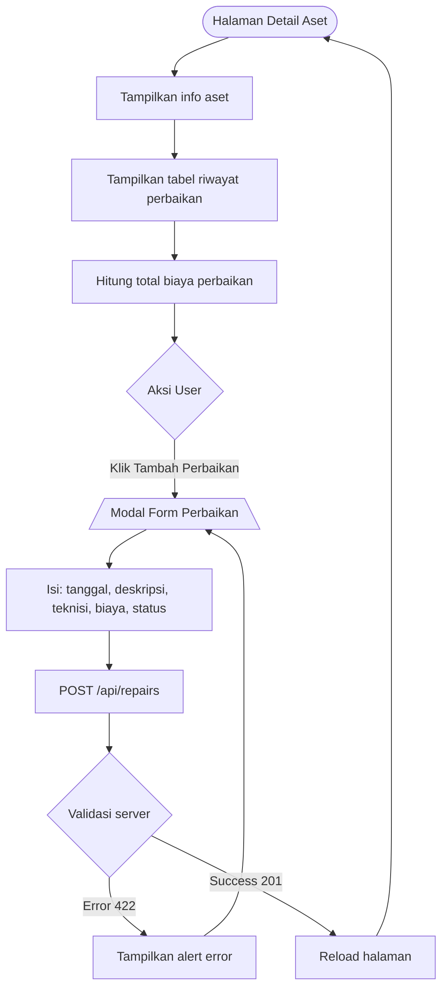
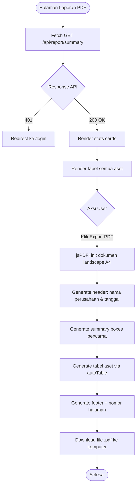
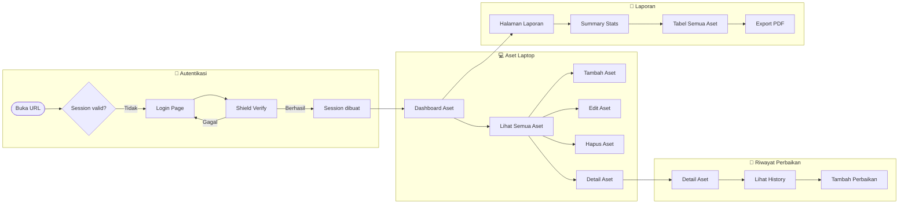
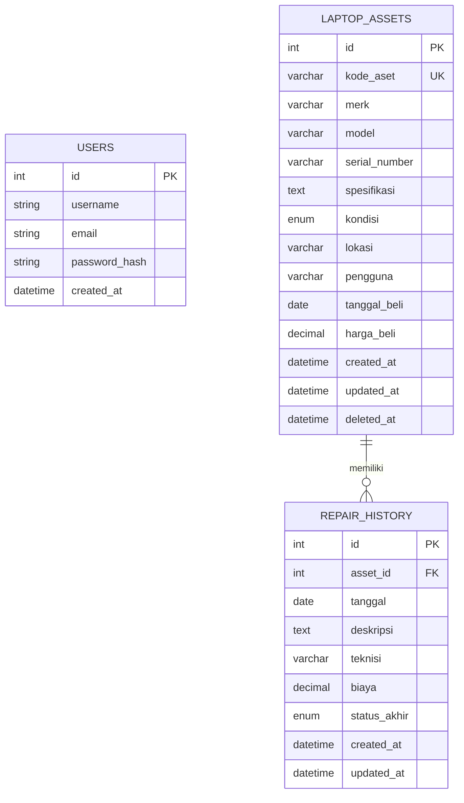

# 💻 Sistem Inventaris Laptop — Abhati Group

> Sistem manajemen aset laptop kantor berbasis web yang dibangun dengan **CodeIgniter 4**, **CodeIgniter Shield**, dan **Bootstrap 5**.  
> Mencakup pencatatan aset, riwayat perbaikan, dan laporan PDF yang digenerate secara frontend.

---

## 📋 Daftar Isi

- [Tech Stack](#tech-stack)
- [Fitur Utama](#fitur-utama)
- [Struktur Proyek](#struktur-proyek)
- [Alur Sistem (System Flow)](#alur-sistem-system-flow)
- [Flowchart Lengkap](#flowchart-lengkap)
- [Alur Pengguna (User Flow)](#alur-pengguna-user-flow)
- [Entity Relationship](#entity-relationship)
- [REST API Endpoint](#rest-api-endpoint)
- [Cara Instalasi](#cara-instalasi)

---

## Tech Stack

| Komponen | Teknologi |
|----------|-----------|
| Framework | CodeIgniter 4.7.3 |
| Language | PHP 8.3 |
| Autentikasi | CodeIgniter Shield |
| Database | MySQL (via Laragon) |
| CSS Framework | Bootstrap 5.3.3 |
| PDF Generator | jsPDF + AutoTable (frontend) |
| Icons | Bootstrap Icons 1.11 |

---

## Fitur Utama

- ✅ **Autentikasi** — Login/logout via CodeIgniter Shield (session-based)
- ✅ **Manajemen Aset** — CRUD lengkap aset laptop (tambah, lihat, edit, hapus)
- ✅ **Riwayat Perbaikan** — Pencatatan history perbaikan per aset
- ✅ **Dashboard Stats** — Ringkasan kondisi aset secara real-time
- ✅ **REST API** — Semua interaksi data melalui JSON API endpoint dengan pagination
- ✅ **API Auth Guard** — Akses API tanpa session mengembalikan JSON 401, bukan redirect HTML
- ✅ **Laporan PDF** — Generate laporan keseluruhan aset langsung dari browser
- ✅ **Soft Delete** — Data aset yang dihapus tetap tersimpan untuk audit trail

---

## Struktur Proyek

```
app/
├── Controllers/
│   ├── AssetController.php          # Web controller (render views)
│   └── Api/
│       ├── AssetController.php      # REST API aset
│       ├── RepairController.php     # REST API riwayat perbaikan
│       └── ReportController.php    # REST API laporan/summary
│
├── Models/
│   ├── AssetModel.php               # Model laptop_assets (soft delete)
│   └── RepairHistoryModel.php       # Model repair_history
│
├── Views/
│   ├── layout/
│   │   └── main.php                 # Layout utama (sidebar + navbar)
│   ├── assets/
│   │   ├── index.php                # Halaman daftar aset
│   │   ├── show.php                 # Halaman detail aset
│   │   └── _form.php                # Komponen form (reusable)
│   └── reports/
│       └── index.php                # Halaman laporan & export PDF
│
├── Config/
│   ├── Routes.php                   # Definisi routing
│   └── Filters.php                  # Auth filter (Shield)
│
└── Database/
    └── Migrations/
        ├── CreateLaptopAssets.php
        └── CreateRepairHistory.php
```

---

## Alur Sistem (System Flow)

Gambaran besar bagaimana sistem bekerja dari sisi arsitektur:

```
┌─────────────────────────────────────────────────────────────────┐
│                          BROWSER (User)                         │
│                                                                 │
│   ┌──────────┐    fetch()    ┌────────────────────────────────┐ │
│   │  View    │ ◄──────────► │      JavaScript (apiFetch)     │ │
│   │ (HTML)   │              │   - Handle 401 → redirect login │ │
│   └──────────┘              │   - Parse JSON response         │ │
│                             └──────────────┬───────────────────┘ │
└──────────────────────────────────────────── │ ──────────────────┘
                                              │ HTTP Request
                                              ▼
┌─────────────────────────────────────────────────────────────────┐
│                       CODEIGNITER 4 (Server)                    │
│                                                                 │
│  ┌─────────────┐    ┌───────────────┐    ┌───────────────────┐  │
│  │  Routes.php │───►│ Filters.php   │───►│   Controller      │  │
│  │             │    │ (Shield Auth) │    │  (Api / Web)      │  │
│  └─────────────┘    └───────────────┘    └────────┬──────────┘  │
│                      ▲                            │             │
│                      │ 401 jika                   │             │
│                      │ belum login                ▼             │
│                  ┌───┴──────┐            ┌────────────────┐     │
│                  │  Shield  │            │    Model       │     │
│                  │  (Auth)  │            │ (AssetModel /  │     │
│                  └──────────┘            │ RepairModel)   │     │
│                                          └───────┬────────┘     │
│                                                  │              │
└──────────────────────────────────────────────────│──────────────┘
                                                   │ Query
                                                   ▼
                                         ┌──────────────────┐
                                         │  MySQL Database  │
                                         │                  │
                                         │ ┌──────────────┐ │
                                         │ │laptop_assets │ │
                                         │ └──────┬───────┘ │
                                         │        │ FK      │
                                         │ ┌──────▼───────┐ │
                                         │ │repair_history│ │
                                         │ └──────────────┘ │
                                         └──────────────────┘
```

---

## Flowchart Lengkap

### 1. Autentikasi (Login Flow)



---

### 2. Manajemen Aset Laptop (CRUD Flow)



---

### 3. Riwayat Perbaikan (Repair History Flow)



---

### 4. Laporan & Export PDF (Report Flow)



---

### 5. Alur Global Sistem (Master Flowchart)



---

## Alur Pengguna (User Flow)

Panduan langkah-langkah yang dilakukan pengguna dalam menggunakan sistem:

### 👤 Skenario 1: Login & Melihat Dashboard

```
1. Buka browser → http://project-abhati.localhost/
   │
   ├─ [Belum login] → Otomatis redirect ke /login
   │   ├─ Input: username + password
   │   └─ Klik "Sign In"
   │       ├─ [Gagal] → Tampil pesan error → Ulangi input
   │       └─ [Berhasil] → Masuk ke dashboard /assets
   │
   └─ [Sudah login] → Langsung ke dashboard /assets

2. Dashboard menampilkan:
   ├─ Stats: Total Aset | Baik | Rusak | Dalam Perbaikan
   └─ Tabel: daftar semua aset laptop
```

---

### 👤 Skenario 2: Menambah Aset Laptop Baru

```
1. Dari dashboard /assets
2. Klik tombol "+ Tambah Aset" (kanan atas)
3. Modal form terbuka → isi data:
   ├─ Kode Aset*     : ABT-LP-001
   ├─ Merk*          : Lenovo
   ├─ Model*         : ThinkPad X1 Carbon
   ├─ Serial Number  : SN-123456
   ├─ Pengguna       : Budi Santoso
   ├─ Kondisi*       : Baik / Rusak / Dalam Perbaikan / Tidak Aktif
   ├─ Lokasi         : Ruang IT Lantai 2
   ├─ Tanggal Beli   : 2024-01-15
   ├─ Harga Beli     : 15000000
   └─ Spesifikasi    : Intel i7, RAM 16GB, SSD 512GB
4. Klik "Simpan Aset"
   ├─ [Validasi gagal] → Toast error merah → perbaiki isian
   └─ [Berhasil] → Modal tutup + tabel refresh + toast hijau
```

---

### 👤 Skenario 3: Melihat & Mengedit Aset

```
1. Dari tabel aset, pada baris aset yang dituju:
   │
   ├─ Klik ikon 👁 (Detail)
   │   └─ Buka halaman /assets/:id
   │       ├─ Tampil: info lengkap aset
   │       └─ Tampil: tabel riwayat perbaikan
   │
   └─ Klik ikon ✏️ (Edit)
       ├─ Modal edit terbuka dengan data existing
       ├─ Ubah field yang diinginkan
       └─ Klik "Simpan Perubahan"
           ├─ [Gagal] → Toast error merah
           └─ [Berhasil] → Modal tutup + tabel refresh
```

---

### 👤 Skenario 4: Mencatat Riwayat Perbaikan

```
1. Dari tabel aset → klik ikon 👁 (Detail) pada aset terkait
2. Di halaman /assets/:id → scroll ke card "Riwayat Perbaikan"
3. Klik tombol "+ Tambah"
4. Modal form perbaikan terbuka → isi data:
   ├─ Tanggal*        : 2024-03-20
   ├─ Deskripsi*      : Keyboard tidak berfungsi, diganti baru
   ├─ Teknisi         : Ahmad Teknisi
   ├─ Status Akhir    : Selesai / Pending / Gagal
   └─ Biaya           : 350000
5. Klik "Simpan"
   ├─ [Gagal] → Alert error
   └─ [Berhasil] → Halaman reload, perbaikan muncul di tabel
```

---

### 👤 Skenario 5: Generate Laporan PDF

```
1. Dari sidebar → klik "Laporan PDF"
2. Sistem otomatis fetch /api/report/summary
3. Halaman menampilkan:
   ├─ Stats cards: Total, Baik, Rusak, Total Biaya Perbaikan
   └─ Tabel lengkap semua aset
4. Klik tombol "Export PDF" (merah, kanan atas)
5. jsPDF memproses di browser:
   ├─ Generate halaman A4 landscape
   ├─ Header: nama perusahaan + tanggal generate
   ├─ Summary boxes berwarna
   ├─ Tabel aset lengkap dengan alternating row
   └─ Footer: nomor halaman
6. File otomatis ter-download:
   └─ Laporan_Aset_Laptop_Abhati_2024-03-20.pdf
```

---

### 👤 Skenario 6: Menghapus Aset

```
1. Dari tabel aset → klik ikon 🗑 (Hapus) pada baris aset
2. Muncul dialog konfirmasi:
   "Hapus aset ABT-LP-001? Data yang dihapus tidak dapat dikembalikan."
   ├─ Klik "Batal" → tidak ada aksi
   └─ Klik "OK" → DELETE /api/assets/:id
       ├─ Database: soft delete (deleted_at diisi timestamp)
       ├─ Data tidak benar-benar terhapus (audit trail)
       └─ Tabel refresh + toast konfirmasi
```

---

## Entity Relationship



---

## REST API Endpoint

Base URL: `http://project-abhati.localhost/api`

> ⚠️ Semua endpoint memerlukan session autentikasi yang valid.

### Aset Laptop

| Method | Endpoint | Deskripsi |
|--------|----------|-----------|
| `GET` | `/assets` | Ambil semua aset + jumlah perbaikan (support pagination: `?page=1&per_page=15`) |
| `GET` | `/assets/:id` | Detail satu aset |
| `POST` | `/assets` | Tambah aset baru |
| `PUT` | `/assets/:id` | Update aset |
| `DELETE` | `/assets/:id` | Soft delete aset |

### Riwayat Perbaikan

| Method | Endpoint | Deskripsi |
|--------|----------|-----------|
| `GET` | `/assets/:id/repairs` | Riwayat perbaikan per aset |
| `POST` | `/repairs` | Tambah riwayat perbaikan |
| `PUT` | `/repairs/:id` | Update riwayat |
| `DELETE` | `/repairs/:id` | Hapus riwayat |

### Laporan

| Method | Endpoint | Deskripsi |
|--------|----------|-----------|
| `GET` | `/report/summary` | Summary statistik kondisi aset |

#### Contoh Request — POST `/api/assets`

```json
{
  "kode_aset": "ABT-LP-001",
  "merk": "Lenovo",
  "model": "ThinkPad X1 Carbon",
  "serial_number": "SN-123456",
  "kondisi": "baik",
  "pengguna": "Budi Santoso",
  "lokasi": "Ruang IT Lantai 2",
  "tanggal_beli": "2024-01-15",
  "harga_beli": 15000000,
  "spesifikasi": "Intel Core i7-12th, RAM 16GB, SSD 512GB NVMe"
}
```

#### Contoh Response — GET `/api/assets`

```json
{
  "status": "success",
  "data": [
    {
      "id": 1,
      "kode_aset": "ABT-LP-001",
      "merk": "Lenovo",
      "model": "ThinkPad X1 Carbon",
      "kondisi": "baik",
      "pengguna": "Budi Santoso",
      "total_perbaikan": 2,
      "created_at": "2024-01-15 09:00:00"
    }
  ],
  "pager": {
    "current_page": 1,
    "per_page": 15,
    "total": 100,
    "total_pages": 7,
    "has_previous": false,
    "has_next": true
  }
}
```

---

## Cara Instalasi

### Prasyarat

- PHP >= 8.1
- Composer
- MySQL / MariaDB
- Laragon / XAMPP / WAMP

### Langkah Instalasi

```bash
# 1. Clone repository
git clone https://github.com/itabhati/<repo-name>.git
cd <repo-name>

# 2. Install dependencies
composer install

# 3. Copy environment file
cp env .env

# 4. Edit .env — sesuaikan konfigurasi database
# CI_ENVIRONMENT = development
# database.default.hostname = localhost
# database.default.database = db_abhati_lokal
# database.default.username = root
# database.default.password =
# database.default.DBDriver = MySQLi

# 5. Jalankan migrasi database
php spark migrate

# 6. (Opsional) Seed data dummy 100 aset untuk testing
php spark db:seed DummyAssetSeeder

# 7. Buat akun admin pertama
php spark shield:user create

# 7. Akses aplikasi
# http://project-abhati.localhost/
```

---

## Nilai Kondisi Aset

| Value | Label | Badge |
|-------|-------|-------|
| `baik` | Baik | 🟢 Hijau |
| `rusak` | Rusak | 🔴 Merah |
| `dalam_perbaikan` | Dalam Perbaikan | 🟡 Kuning |
| `tidak_aktif` | Tidak Aktif | ⚫ Abu-abu |

---

## Tim Pengembang

**Abhati Group — Departemen IT**

> Sistem ini dikembangkan sebagai bagian dari **Sistem Operasional Abhati** untuk mendukung pengelolaan aset teknologi informasi perusahaan.

---

*Last updated: 2025 — Abhati Group IT Division*